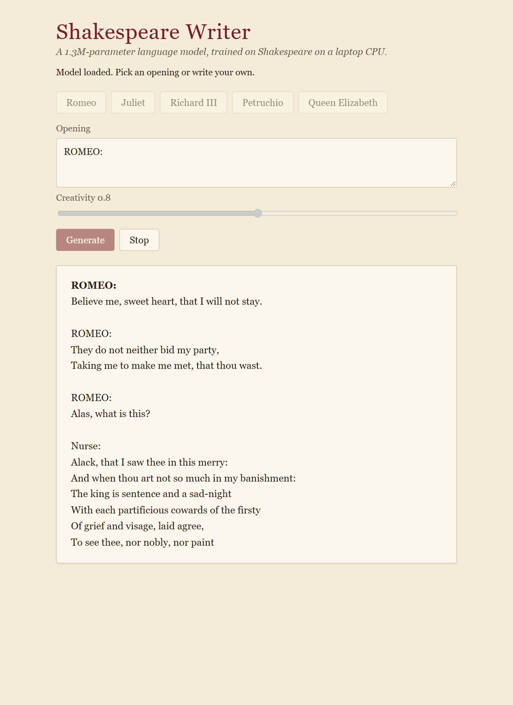

# Shakespeare Writer

[](https://github.com/Alex220205/shakespeare-writer/actions/workflows/ci.yml)

A small language model that writes Shakespeare, trained from scratch on a laptop CPU, with a web page that streams its writing a token at a time.



It takes a classic character-level GPT (learned position embeddings, LayerNorm, hand-written attention heads, a ReLU feed-forward) and rebuilds every part the way a model is built in 2026: the tokenizer, the position encoding, the attention, the feed-forward layer, the optimizer, how text is sampled, and how it reaches the reader.

## What changed from a classic GPT, and why

| Classic character-level GPT | Shakespeare Writer | Used by |
|---|---|---|
| 65-character vocabulary | Byte-level BPE, 1024 tokens, trained on the corpus with Hugging Face `tokenizers` | GPT-4o, Llama 3, Qwen3 |
| Learned position-embedding table | Rotary position embeddings (RoPE), computed rather than learned | Llama, Qwen3, DeepSeek, Gemma |
| LayerNorm | RMSNorm | Nearly every current model |
| Six hand-written attention heads | Grouped-query attention: 4 query heads share 2 key/value heads, in one fused `scaled_dot_product_attention` call | Llama 3 and 4, Qwen3, gpt-oss |
| Raw queries and keys | QK-norm: queries and keys RMS-normalised per head before RoPE | OLMo 2, Gemma 3, Qwen3 |
| ReLU feed-forward | SwiGLU (gated) feed-forward | Llama, Qwen3, DeepSeek |
| Separate output layer, biases everywhere | Output layer tied to the token embedding; no biases | Gemma, Llama 3.2 |
| Re-reads the whole context for every new token | KV cache: the prompt is read once, then one token per step | Every serving stack |
| Samples from the full softmax | Temperature plus min-p sampling (ICLR 2025) | Hugging Face, vLLM, SGLang |
| AdamW at a fixed learning rate | Muon for the weight matrices, AdamW for the rest; warmup-stable-decay schedule | Kimi K2, Moonlight; MiniCPM, DeepSeek-V3 |
| Loss in nats per character | Also bits per byte, which compares fairly across tokenizers | nanochat and current evaluations |
| Prints 500 characters at the end | Streams to a React page over Server-Sent Events | Every chat interface |

Each module's docstring explains its part of this table in more detail: [model.py](model/shakespeare_model/model.py), [writer.py](model/shakespeare_model/writer.py), [train.py](model/shakespeare_model/train.py), [tokenizer.py](model/shakespeare_model/tokenizer.py), [muon.py](model/shakespeare_model/muon.py).

**Why Muon is hand-written.** PyTorch has shipped Muon as `torch.optim.Muon` since 2.9, but it runs its Newton–Schulz iteration in bfloat16. A laptop CPU without bfloat16 matrix instructions has to emulate that, and one optimizer step took 5.2 seconds, against 13 ms for AdamW. [muon.py](model/shakespeare_model/muon.py) is the same algorithm in about 40 lines of float32, and [a test](model/tests/test_muon.py) checks that it takes the same step as PyTorch's to within bfloat16 rounding. Over 250 steps with the same seed, it reached 2.36 validation bits per byte against AdamW's 2.45.

## Results

Both models trained on the same laptop CPU (Intel i3-1215U, no GPU) from the same 1 MB of text. Lower bits per byte is better: it measures how surprised the model is by Shakespeare it has not seen, and unlike loss per token it can be compared across tokenizers.

The baseline is a classic character-level GPT at small settings: 60-dimensional embeddings, 6 layers of 6 attention heads, a 128-character context, and 5000 AdamW steps on batches of 32. Its script is not part of this repository.

| | Classic GPT baseline (character-level) | Shakespeare Writer |
|---|---|---|
| Vocabulary | 65 characters | 1024 BPE tokens, 2.4 characters each |
| Parameters | 0.28M | 1.31M |
| Validation bits per byte after about 21 minutes | 3.18 (21 min, step 1000) | **2.19** (22 min, step 600) |
| Validation bits per byte, fully trained | 2.64 after 1 h 47 min (5000 steps) | **2.08** after 50 minutes (1400 steps) |

Given about the same time, the new model is a full bit per byte less surprised by unseen text. Fully trained, it ends 0.56 bits per byte lower in under half the time. It is also bigger, and the table is honest about that: the comparison is what each design achieves on the same hardware in the time it takes, which is the constraint that decided its size.

The difference shows in the writing. The baseline, fully trained, mostly invents words:

```
DORTHARS:
For word! now it spelosf in crrutime!
EON, in cangued to off isdier: yet she. sin't:
The give thee reem facencsles
```

Shakespeare Writer, prompted with `ROMEO:`:

```
ROMEO:
What is he that bad?

JULIET:
That I have done, my father!

ROMEO:
O, let's away.

JULIET:
Hence comes it not a little.

ROMEO:
I tell thee, my lord:
I'll be short and pluck her highness,
And I am ta'en, if I be not so,
I'll beat thee from my heart.
```

## Running it

Needs [uv](https://docs.astral.sh/uv/) and Node 22 or later. A trained model is committed, so there is nothing to train first.

```bash
uv sync --all-packages

# Terminal 1: the API, on http://localhost:8100
cd backend
uv run uvicorn app.main:app --port 8100 --reload --reload-dir . --reload-dir ../model

# Terminal 2: the page, on http://localhost:5180
cd frontend
npm install
npm run dev
```

Open http://localhost:5180, pick an opening or type your own, and press Generate. The API's own documentation is at http://localhost:8100/docs.

The ports are 8100 and 5180 rather than uvicorn's and Vite's defaults (8000 and 5173), so the project can run beside others that use those. `--reload` restarts the API whenever code in `backend/` or `model/` changes; the page reloads itself the same way. Without it, an API left running keeps serving the code it started with.

### Retraining

```bash
cd model
uv run python -m shakespeare_model.train
```

This takes about 50 minutes on a laptop CPU, prints the loss as it goes, overwrites `model/checkpoints/shakespeare.pt` whenever validation loss improves, and ends with a sample. Restart the API afterwards so it loads the new model. Every hyperparameter is a constant in [config.py](model/shakespeare_model/config.py).

### Configuration

| Variable | Default | Read by |
|---|---|---|
| `CORS_ORIGINS` | `http://localhost:5180` | API: comma-separated origins allowed to call it |
| `CHECKPOINT_PATH` | `model/checkpoints/shakespeare.pt` | API: the model to serve |
| `VITE_API_URL` | `http://localhost:8100` | Page, at build time: where the API is |

## API

| Endpoint | Returns |
|---|---|
| `GET /health` | `{"status": "ok", "model": "loaded", "version": "0.1.0"}`, or `degraded` / `missing` when no model has been trained |
| `GET /generate?prompt=ROMEO:&temperature=0.8&length=500` | A `text/event-stream`: one event per token of text, then a `done` event. It writes at least `length` characters (100–1500), then finishes the speech it is in, so it never stops mid-word. 422 for an invalid query, 503 when no model has been trained |

## Tests

```bash
uv run ruff check . && uv run ruff format --check .
cd model && uv run pytest        # tokenizer, model, generation, training pieces
cd backend && uv run pytest      # endpoints and CORS, against a tiny in-memory model
cd frontend && npm run lint && npm test && npm run build
```

No test needs the network, a GPU or the trained checkpoint, apart from one that checks the committed checkpoint still loads. CI runs all of it on every push.

## Layout

```
model/       the language model: torch and tokenizers, nothing web-related
  data/            Tiny Shakespeare (public domain)
  checkpoints/     the trained model, with its tokenizer inside
  shakespeare_model/
    config.py      every hyperparameter and path
    tokenizer.py   byte-level BPE
    model.py       the transformer
    writer.py      sampling, the KV cache, saving and loading
    muon.py        the Muon optimizer, in float32
    train.py       the training loop
backend/     FastAPI: GET /health and GET /generate
frontend/    React + Vite: the page
```

## Acknowledgements

The corpus is Tiny Shakespeare, 1.1 MB of Shakespeare's plays, from the [char-rnn](https://github.com/karpathy/char-rnn) repository.

## Licence

The code is MIT-licensed; see [LICENSE](LICENSE). Shakespeare's text is in the public domain.
